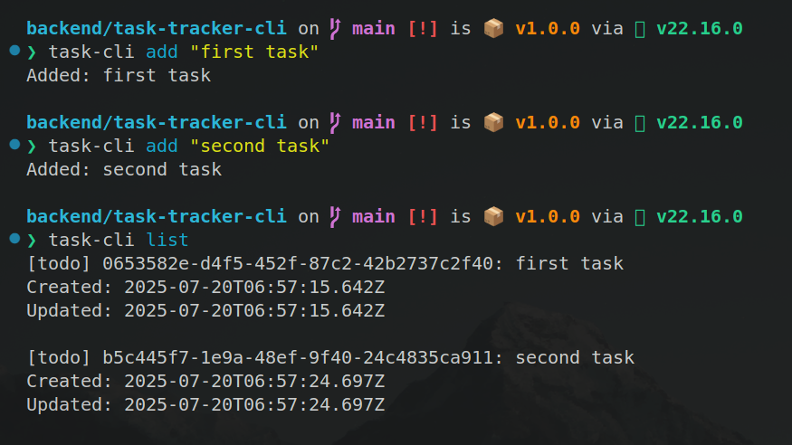
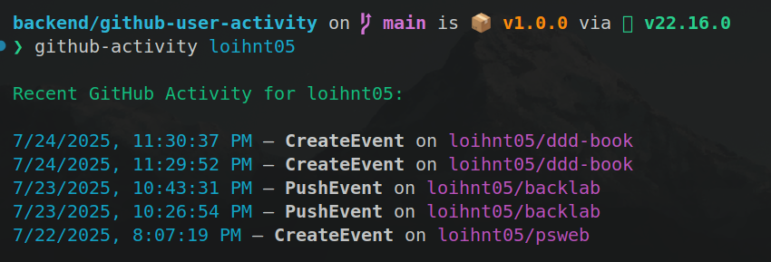
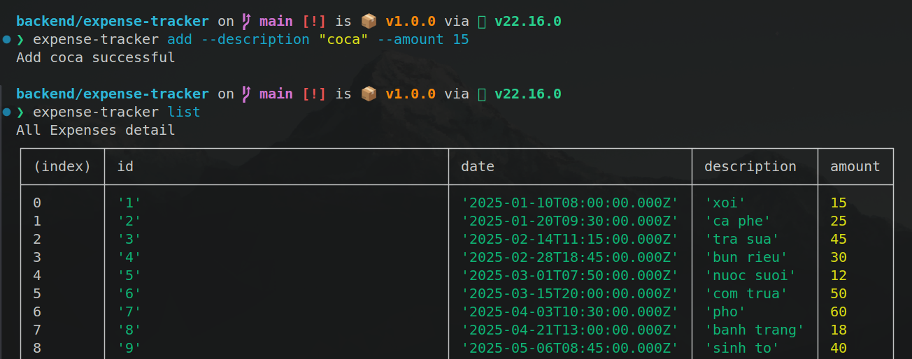
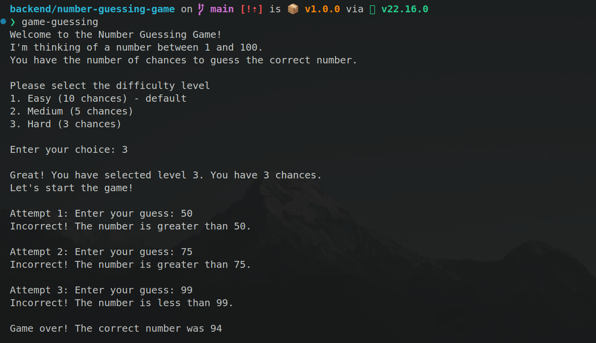
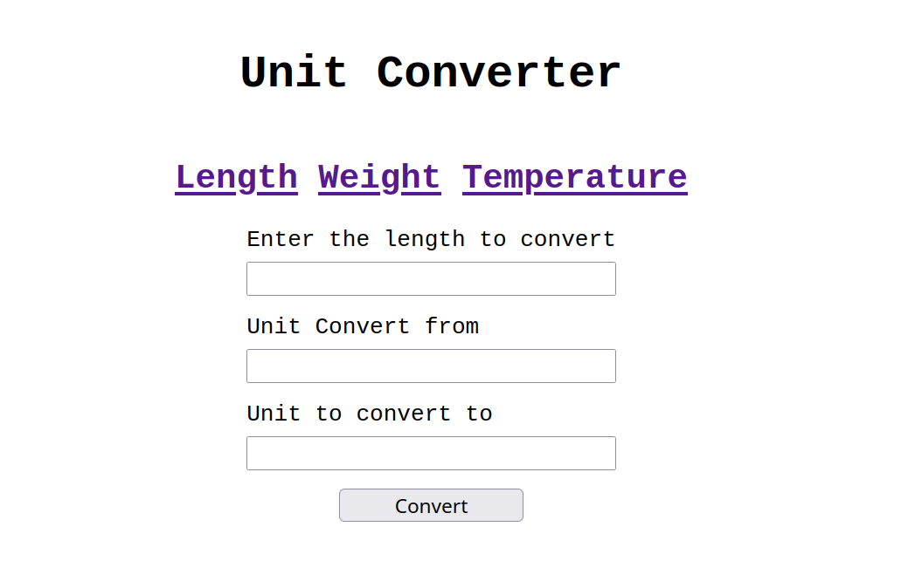

# 🛠️ Backend Laboratory

This repository contains backend projects built following the <a href="https://roadmap.sh/backend/projects">roadmap</a> back-end developer path.

## 📂 Projects List

### 🧪 Beginner

- <a href='https://github.com/loihnt05/backlab/tree/main/task-tracker-cli'> Task Tracker CLI </a>
- <a href='https://github.com/loihnt05/backlab/tree/main/github-user-activity'> Github User Activity </a>
- <a href='https://github.com/loihnt05/backlab/tree/main/expense-tracker'> Expense Tracker </a>
- <a href='https://github.com/loihnt05/backlab/tree/main/number-guessing-game'> Number Guessing Game </a>
- <a href='https://github.com/loihnt05/backlab/tree/main/unit-converter'> Unit Converter </a>

### 🧰 Intermediate

### 🧠 Advanced

---

## 📸 Project Screenshots

Click any of the images below to view the readme and live demo of the project.

  
  
  
  
  

  
  
  

  

    Maintained with ☕ & ❤️ by 
    <a href="https://github.com/loihnt05"><strong>TaiLoiHo</strong></a>
     
  
     • Open Source • 
  
   
   © 2025
  

