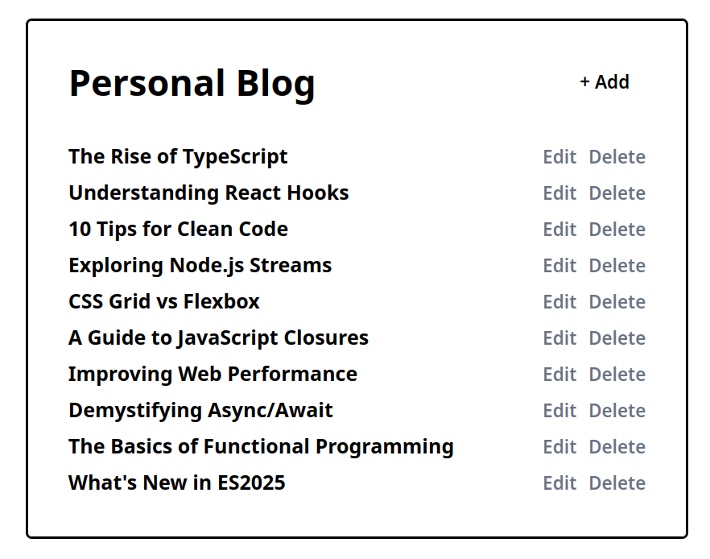

# Personal Blog

## Requirement

- Guest Section — A list of pages that can be accessed by anyone:

  - Home Page: This page will display the list of articles published on the blog.
  - Article Page: This page will display the content of the article along with the date of publication.

- Admin Section — are the pages that only you can access to publish, edit, or delete articles.

  - Dashboard: This page will display the list of articles published on the blog along with the option to add a new article, edit an existing article, or delete an article.
  - Add Article Page: This page will contain a form to add a new article. The form will have fields like title, content, and date of publication.
  - Edit Article Page: This page will contain a form to edit an existing article. The form will have fields like title, content, and date of publication.

## Implementation

### Storage

To keep things simple for now, you can use the filesystem to store the articles. Each article will be stored as a separate file in a directory. The file will contain the title, content, and date of publication of the article. You can use JSON or Markdown format to store the articles.

### Backend

You can use any programming language to build the backend of the blog. You don’t have to make it as an API for this project, we have other projects for that. You can have pages that render the HTML directly from the server and forms that submit data to the server.

### Frontend

For the frontend, you can use HTML and CSS (no need for JavaScript for now). You can use any templating engine to render the articles on the frontend.

### Authentication

You can implement basic authentication for the admin section. You can either use the standard HTTP basic authentication or simply hardcode the username and password in the code for now and create a simple login page that will create a session for the admin.
