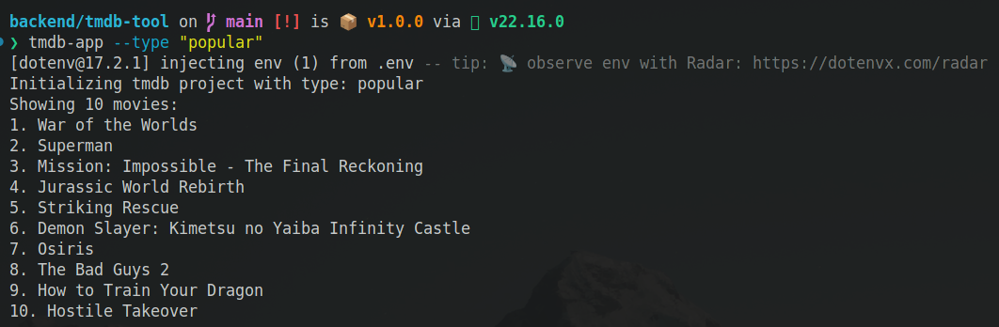

# TMDB CLI TOOL - THE MOVIE DATABASE

## Requirement

The application should run from the command line, and be able to pull and show the popular, top-rated, upcoming and now playing movies from the TMDB API. The user should be able to specify the type of movies they want to see by passing a command line argument to the CLI tool.

## Implementation

- Handle errors gracefully, such as API failures or network issues.
- Use a programming language of your choice to build this project.
- Make sure to include a README file with instructions on how to run the application and any other relevant information.
- Read docs api of TMDB from:
    - <a href="https://developer.themoviedb.org/reference/movie-now-playing-list">List Movies Now Playing</a>
    - <a href="https://developer.themoviedb.org/reference/movie-top-rated-list">List Movies Top Rated</a>
    - <a href="https://developer.themoviedb.org/reference/movie-popular-list">List Movies Popular</a>
    - <a href="https://developer.themoviedb.org/reference/movie-upcoming-list">List Movies Upcoming</a>
- Get API access from https://www.themoviedb.org/settings/api (API token + API KEY)
